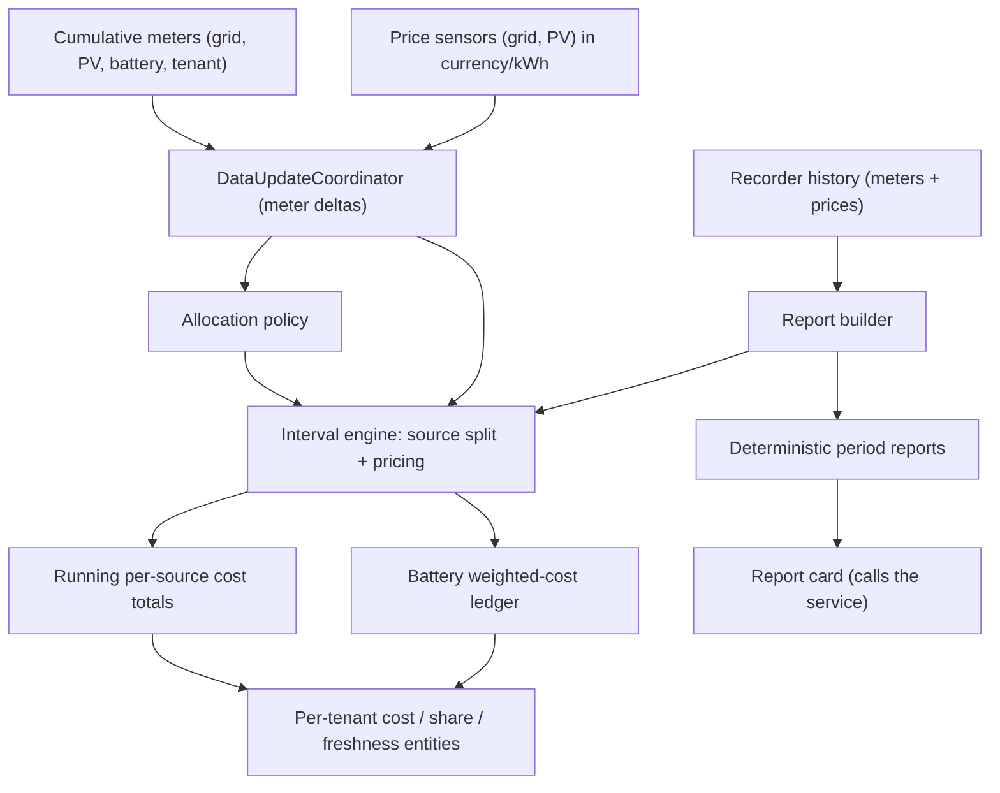

# Architecture

This document orients developers. For the authoritative specification and
invariants, read [`REQUIREMENTS.md`](REQUIREMENTS.md). For user-facing
explanations, read the [documentation site](https://yeaxi.github.io/shared-energy-ledger/).

Shared Energy Ledger is a **read-only accounting layer** for Home Assistant.
It never controls physical devices, never calls side-effecting services, and
never mutates recorder state. It reads meter entities the operator supplies,
allocates shared energy between tenants, prices it against a time-of-use
tariff, and produces per-tenant cost sensors and deterministic reports.

## Repository layout

```
custom_components/shared_energy_ledger/   # the Home Assistant integration
dashboard/                                # companion Lovelace cards
tests/                                    # pytest suite (unit + integration)
docs/                                     # mkdocs documentation site
scripts/                                  # dev helpers (lint, traceability, i18n)
.cursor/skills/                           # reusable HA-development skills
REQUIREMENTS.md                           # public specification (source of truth)
```

## Integration components

The integration package (`custom_components/shared_energy_ledger/`) is
organized around a coordinator that refreshes a typed snapshot which the
entities render.

- `config_flow.py` / `configio.py` / `models.py` — the UI config and options
  flow, and the typed configuration model persisted on the config entry.
- `samples.py` — pure validators that turn raw states into typed floats,
  enforcing unit, freshness, and finiteness (including the `<currency>/kWh`
  price unit).
- `coordinator.py` — a `DataUpdateCoordinator` that turns cumulative-meter
  readings into interval deltas, prices each interval, and accrues restart-safe
  per-tenant cost totals.
- `allocation.py` — splits building consumption energy across tenants according
  to the selected allocation policy.
- `interval.py` — the pure per-interval engine that distributes the grid/PV/
  battery source mix across tenants and prices each source at its own per-kWh
  rate. Shared by the live coordinator and the report builder.
- `ledger.py` / `ledger_store.py` — the weighted-cost battery ledger and its
  persistent store, keeping priced stock separate from raw kWh.
- `cost_store.py` — persists counter anchors and the running per-source cost
  totals so the cumulative-cost sensors are pure renderers.
- `report.py` / `report_builder.py` — deterministic Recorder-based reports for
  any timeframe, recomputed from meter and price history via `interval.py`.
- `sensor.py` / `binary_sensor.py` / `entity.py` — the entity platforms and
  their shared base.
- `services.py` / `services.yaml` — the exposed services (rebuild report, reset
  battery ledger).
- `diagnostics.py` / `issues.py` — redacted diagnostics and repair issues.
- `const.py` — the integration domain and constants.

## Data flow



## The fail-closed contract

The central design rule is that missing, stale, or wrong-unit upstream data
must never be treated as `0`. When an input is unusable, the freshness gate
flips off and dependent cost and allocation sensors report `unavailable`
rather than a fabricated value. This contract is enforced by the invariants in
[`REQUIREMENTS.md`](REQUIREMENTS.md) and by the
`scripts/lint_no_silent_zero.py` check.

## Testing and traceability

- `tests/unit/` covers the pure-Python accounting core with no Home Assistant
  runtime.
- `tests/integration/` boots a mock Home Assistant via
  `pytest-homeassistant-custom-component` and exercises the flows, entities,
  and services.
- `scripts/check_requirements_traceability.py` verifies every invariant from
  `REQUIREMENTS.md` is covered by at least one test module and one docs page.

See [`CONTRIBUTING.md`](CONTRIBUTING.md) for the full verification gate.
