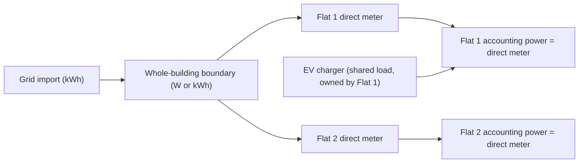
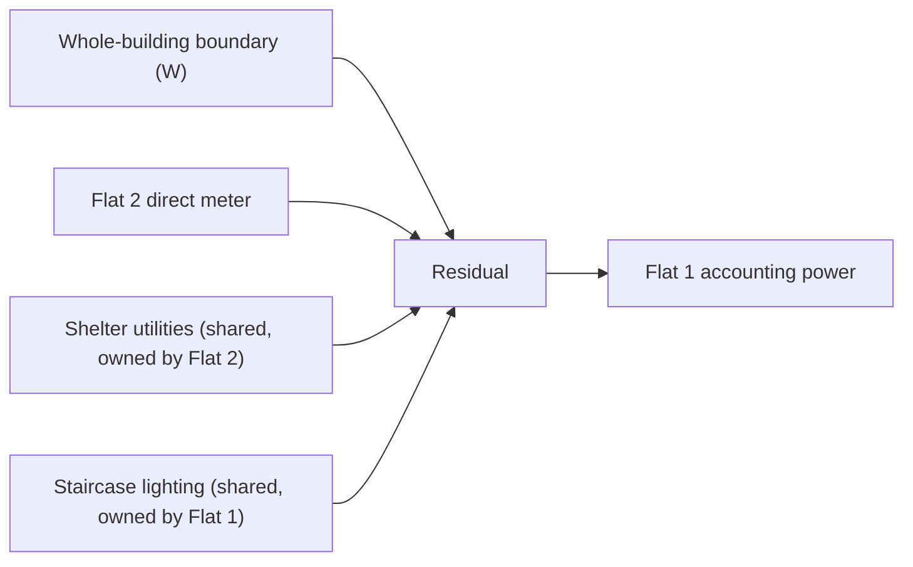
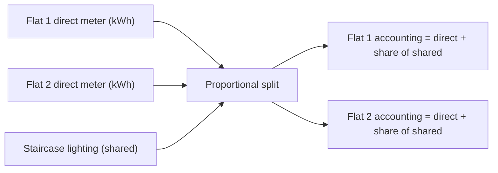

# Allocation policies

Energy Split ships exactly three allocation policies. The enum is closed
at the type-system level: any other value keeps a tenant's accounting
chain `unavailable`, in line with
[invariant I3](invariants.md).

| Policy | When to use |
| --- | --- |
| `direct_meter` | The tenant has its own dedicated energy meter and does not depend on shared loads. |
| `residual_of_total_minus_others` | A whole-building boundary is measured; one tenant is metered by subtracting all sibling loads and shared loads from that boundary. |
| `proportional_by_direct_meters` | No boundary is measured; shared loads are split between tenants in proportion to their direct-meter energy. |

All diagrams below use generic tenants (`flat-1`, `flat-2`) and generic
shared loads (shelter utilities, staircase lighting, an EV charger).
They are illustrative and do not describe any real installation.

## `direct_meter`

The tenant's accounting power equals its direct meter reading. Shared
loads that this tenant *owns* still contribute to the tenant's total,
but they are added on top of the direct meter, not derived from a
boundary. Invalid or stale direct meters propagate as `unavailable`.

Common mistakes:

- Assigning a shared load to a tenant whose direct meter already
  measures that load. This double-counts energy.
- Using this policy for a tenant that has no direct meter. The
  tenant's chain stays `unavailable`.

## `residual_of_total_minus_others`

The tenant's accounting power equals the whole-building boundary minus
the sum of every sibling tenant's power and every shared load owned by
another tenant. The residual is only accepted when the inputs are
finite, non-negative, unit-consistent, time-aligned within a bounded
skew window (default 180 seconds), and produce a non-negative residual.
Negative, unaligned, or unit-inconsistent residuals stay unknown; they
are never clamped to zero. See [invariant I4](invariants.md).

The example above computes `Flat 1` as
`boundary - (flat_2_meter + shelter + staircase)`. Because staircase
lighting is owned by `flat-1`, it is added back into the tenant's
financial ownership even though it is subtracted from the residual.

## `proportional_by_direct_meters`

When no whole-building boundary exists but you still want to split
shared loads fairly, each tenant absorbs a fraction of the shared-load
energy in proportion to their direct-meter energy. The direct meters
are the denominator; if any denominator is zero or missing over the
period, the interval stays unknown.

Notes:

- Proportional splitting only affects the shared loads that are
  explicitly listed in the tenants' `shared_loads` fields. Loads that
  are already inside a direct meter must not be listed again.
- The proportional weight is recomputed per interval. It does not
  smooth or interpolate across missing intervals.

## Choosing a policy

- Prefer `direct_meter` when every tenant has a physical meter.
- Choose `residual_of_total_minus_others` when only one tenant is
  unmetered and you trust the whole-building boundary as an
  AC-load-side reading. Remember that a whole-building sensor is a
  *policy input*, not an independent physical measurement of each
  tenant.
- Reach for `proportional_by_direct_meters` when a shared load is
  small enough that an approximate split is acceptable and the tenants
  agree on the weighting scheme.
