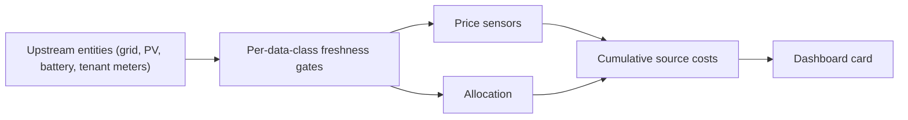

# Troubleshooting

Because Shared Energy Ledger refuses to invent a zero, the most common
support question is *"why does my cost sensor say `unavailable`?"*
This page walks through the freshness-gate chain, common causes, and
how to gather a redacted diagnostics bundle for community issues.

## The availability chain

Every cost sensor depends on a chain of upstream availability. If any
link is broken, the sensor stays `unavailable` on purpose, per
[invariant I1](invariants.md).



Read the diagram left to right when diagnosing:

1. Check the upstream entities first.
2. Check the freshness gate for that data class.
3. Check the price sensors.
4. Check the allocation output.
5. Check the cumulative source-cost sensors, then the card.

## Common causes

### Wrong unit of measurement

- Cumulative meters must be `kWh`. A `kW` cumulative counter is
  rejected at both live-state and report-generation time, per
  [invariant I5](invariants.md).
- Power sensors must be `W`. A `kW` power sensor is rejected.

Fix: update the source entity's `unit_of_measurement` (via customize,
template, or upstream integration configuration) and reload the
Shared Energy Ledger config entry.

### Stale `last_updated`

- Every upstream must publish an update within the freshness window
  for its data class. Defaults are:
    - `900 s` for the battery counters,
    - `300 s` for the grid, PV, and tenant meters.
- Sensors with a **future** `last_updated` are also rejected. This can
  happen when a device clock is unset.

Fix: verify the source integration is polling. Correct the device
clock. Consider widening the freshness window from the options flow
only when the source is genuinely low-cadence.

### Non-monotonic counter

- Cumulative counters that decrease are rejected by the freshness
  gate. This most often happens after a hardware reset or a
  configuration change on the source integration.

Fix: use a `utility_meter` helper in front of the raw counter, or use
the source integration's dedicated *total* entity instead of a
resettable one.

### Boundary-pair violation on the battery ledger

- The `(stock_kwh, stock_cost)` pair must be coherent, per
  [invariant I6](invariants.md).
- Common violations: setting a positive `stock_cost` while
  `stock_kwh == 0`, or vice versa.

Fix: call `shared_energy_ledger.reset_battery_ledger` with a coherent pair,
for example `(0, 0)` to declare the battery empty, or the true stock
values immediately after a manual reconciliation.

### Residual allocation preconditions

- The `residual_of_total_minus_others` policy is only accepted when the
  boundary, sibling loads, and shared loads are all present, unit-
  consistent, time-aligned within the skew window, and produce a
  non-negative residual. See [invariant I4](invariants.md).

Fix: check that every sibling tenant reports a fresh value, that
shared-load sensors are wired to the correct tenants, and that no
sensor is publishing at a much slower cadence than the boundary.

### Price sensor or currency mismatch after upgrade

- Currency changes and price-sensor swaps open a new **accounting
  epoch**. Historical intervals keep the prices recorded at the time
  and are not silently re-priced from today's sensor.
- If a live cost sensor shows `unavailable` immediately after an
  upgrade, check that the grid import price sensor (and the PV price
  sensor, unless PV is marked zero-cost) reports a finite value in
  `currency/kWh` matching the configured currency.

Fix: open the reconfigure or options flow and confirm the price
sensors are selected, available, and use the expected unit.

### Dashboard shows `unavailable`

- Cards fail closed on purpose, per [invariant I10](invariants.md).
- A card that renders `0.00` when the sensor is `unavailable` is a
  card bug, not an integration bug. Report it against the card
  package.

## Diagnostics download

Home Assistant supports downloading a redacted diagnostics bundle for
any integration. From **Settings** > **Devices & services** >
**Shared Energy Ledger** > **Download diagnostics**, you get a YAML file with:

- the config-entry snapshot (with entity IDs redacted),
- the coordinator's last successful and failed updates,
- the last report metadata (revision hash and `finalized_as_of`),
- the ledger status and recent transitions.

When filing a community issue:

1. Attach the diagnostics YAML.
2. Include the Home Assistant and Shared Energy Ledger versions.
3. Describe the expected and observed behavior in generic terms
   (`flat-1`, `flat-2`, and so on). Do not paste real personal data.
4. If the issue reveals a secret or a personal identifier by mistake,
   follow the security-disclosure workflow in `SECURITY.md`.

## Reading logs

Enable verbose logging for the integration through:

```yaml
logger:
  default: info
  logs:
    custom_components.shared_energy_ledger: debug
```

Reload Home Assistant, reproduce the failure, and copy the relevant
log lines. Redact any device names or addresses before sharing.
